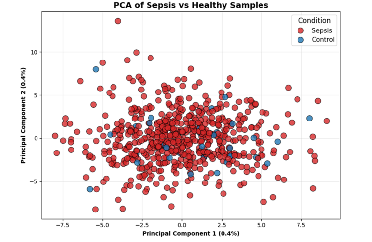
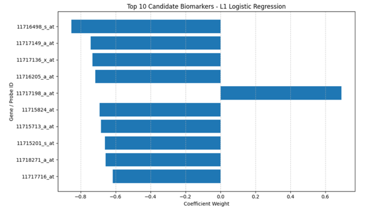

# 🧬 Sepsis Biomarker Discovery & Classification Pipeline

## 📌 Project Overview
This repository contains a comprehensive computational biology and machine learning pipeline designed to classify sepsis patients using high-dimensional gene expression data. The project aims to identify critical hub genes (biomarkers) and develop a robust predictive model using state-of-the-art data balancing and threshold optimization techniques.

## 📂 Dataset Access
Due to GitHub's file size limitations (>100MB), the primary high-dimensional dataset (`sepsis_gene_expression_LABELED.csv`) is securely hosted on Google Drive. 

* **📥 [Download the Dataset via Google Drive](https://drive.google.com/file/d/1H0viWaTas90fQ5LXQY7XTFF57zpLiXHv/view?usp=sharing)**

## ⚙️ Methodology Highlights
Our pipeline addresses the extreme class imbalance typically found in clinical datasets (e.g., 153 Sepsis vs. 8 Control samples in the test set) through a rigorous methodology:
1. **Triple Algorithm Feature Selection:** Extracting VIP hub genes using the intersection of LASSO (L1), Random Forest, and SVM-RFE.
2. **Anti-Leakage Data Balancing:** Applying **SMOTE** strictly within a cross-validated pipeline (`ImbPipeline`) on the training set to preserve test set integrity.
3. **Out-of-Fold Threshold Optimization:** Utilizing **Youden's J Statistic** on cross-validated training probabilities to dynamically shift decision boundaries, ensuring high sensitivity for the minority class without compromising overall AUC.

## 📊 Key Results

### 1. Data Quality & Distribution (PCA)
Visualizing the variance and separability of Sepsis vs. Healthy Control samples using Principal Component Analysis to ensure dataset quality.

### 2. Biomarker Selection (Intersection)
We isolated the most critical genes responsible for differentiating sepsis from healthy controls by finding the intersection of three robust ML algorithms.

The following bar chart illustrates the top sepsis-associated biomarkers ranked by their feature importance scores:

### 3. Model Performance
The optimized Support Vector Machine (SVM) and Random Forest achieved superior diagnostic performance after automated threshold tuning.

## 🚀 How to Use
To reproduce the results, you can run the notebook directly via Google Colab:
1. Open the `Machine_Learning_Pipeline.ipynb` file.
2. Ensure you have mounted the `sepsis_gene_expression_LABELED.csv` correctly.
3. Run all cells sequentially.

